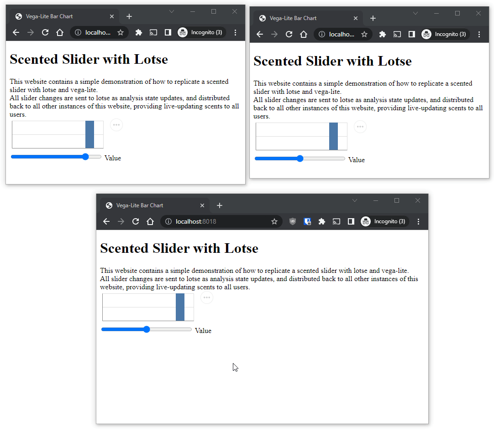

# Lotse: Vega Example

This simple example how Lotse can interface with vega by providing new data to visualize. 

## Try it out

1. `docker compose up`

## Demo Content

This demo shows how to replicate Scented Widgets with Lotse.

All three clients connected in the demo write to the same analysis state, meaning that all collected scents are shared among all current windows.